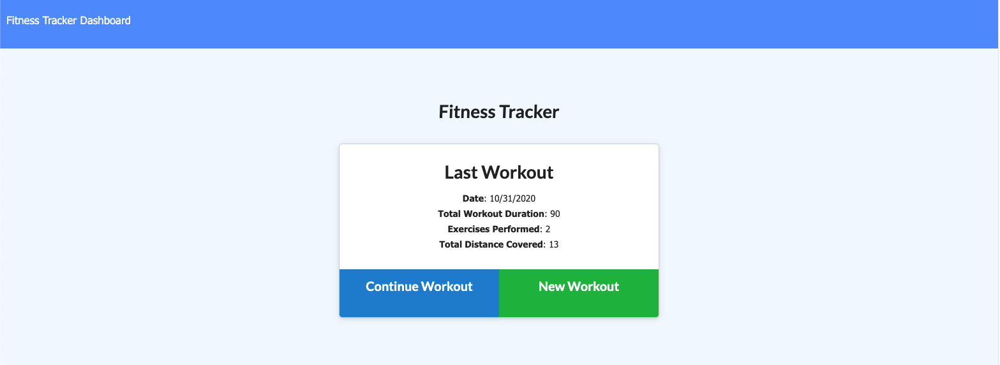
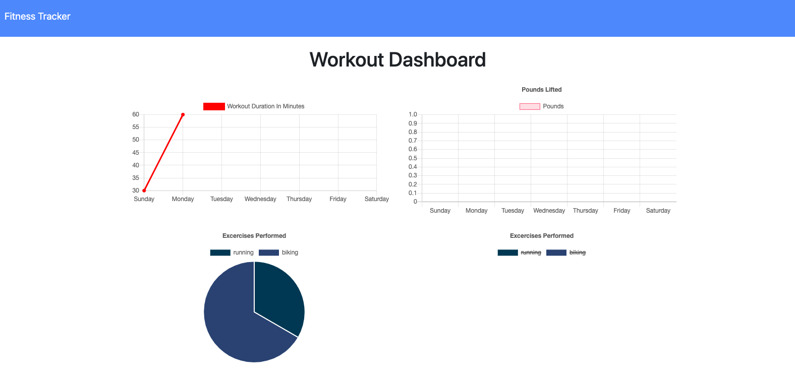

# Workout Tracker

  

  ## Description

  The application is a workout tracker that allows you to view, create, and track daily workouts. You have the option to choose between a cardio workout that allows for time and distance of the exercise to be tracked or a resistance workout that keeps record of the name, type, weight, sets, reps, and duration of the exercise.

  ## Table of Contents

  -[Installation](#installation)

  -[Usage](#Usage)

  -[License](#license)

  -[Contributing](#contributing)

  -[Tests](#tests)

  -[Questions](#questions)
  
  -[Demonstration](#demonstration)

  ## Installation

  npm i mongoose, npm i morgan, npm i express

  ## Usage

  Make sure to npm install all dependencies and to use the seed.js to play with some data.

  ## License

  This project is licensed under [MIT](https://opensource.org/licenses/MIT) license.

  ## Contributing

  Please create your own branch and be careful.

  ## Tests

  TBD

  ## Questions

  If you have any questions about the repo, open an issue or contact me directly at egomezfax19@gmail.com. You can find more of my work at [www.github.com/egome019](https://github.com/egome019)
  
  ## Demonstration
  
  [Click here](https://secure-hamlet-15255.herokuapp.com/) to be directed to the application.
  
  
  

  
